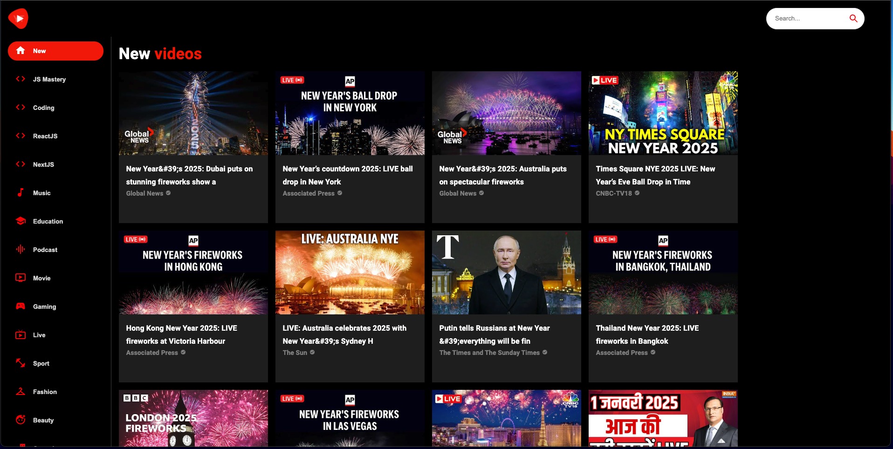
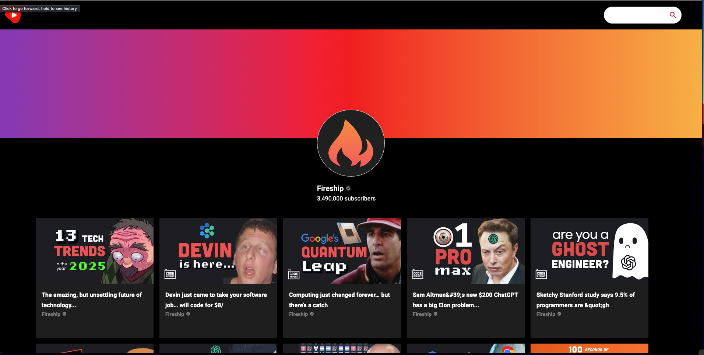
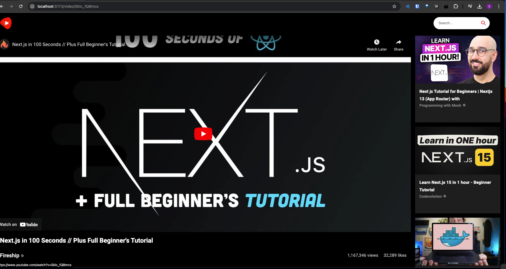

# AntTube by Anthony Nguyen

## A YouTube clone using Typescript, React and Vite Bundling

[https://antube.netlify.app](https://antube.netlify.app)

This YouTube clone is a way to use the YouTube API from RapidAPI, supporting features such as:

- Seeing a video feed of recommended videos
- See Youtube Channels
- Play Youtube videos
- See statistics such as Views and Likes

### Home Page

### Channel Page

### Video Detail Page

